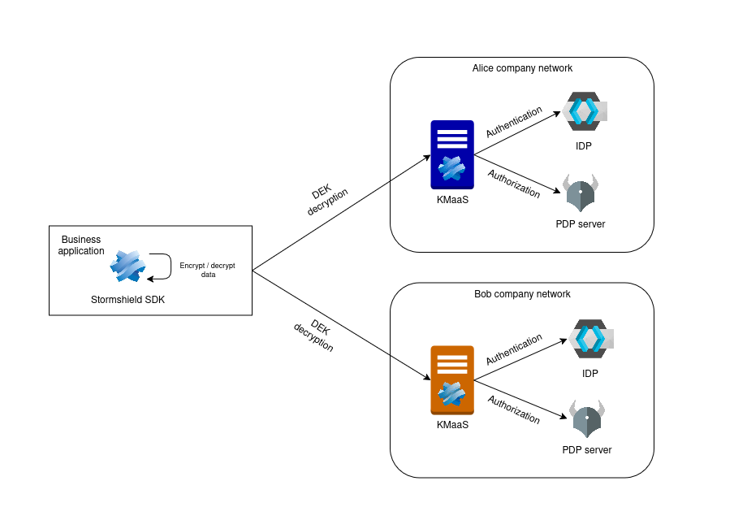

# Example of using the Stormshield SDK

This repository contains a small **TypeScript** project illustrating the main features of the *Stormshield SDK*:
    - SDK configuration
    - File encryption
    - File decryption
    - Attribute‑Based Access Control (ABAC)


It includes two example scenarios: a full [**Base Example**](#base-example-scenario) and a minimal [**Quick‑Start**](#quick-start-example) demonstration.

The project follows the official SDK documentation: <https://documentation.stormshield.eu/SEP/en/Content/SDK_doc/>.

---

## Prerequisites

- **Docker** (for the provided `docker-compose.yml`) – used to run the SEP platform.
- **stormshield/kmaas:4.6.0.309** Docker image – must be loaded from a tgz archive (see note below).
- **stormshield-sdk/sdsdk.tgz** – the SDK archive must be supplied by the user and placed in the `stormshield-sdk/` directory.

[Contact us](https://www.stormshield.com/sds-registration/) for more informations about KMaaS and the Stormshield SDK.

## Installation

Before starting, load the required KMaaS image from the supplied tgz archive:

```bash
docker load -i stormshield-kmaas.tgz
```

If you need to use a different version or image name, edit the `image:` field in `docker-compose.yml` accordingly.

All required components are run inside Docker containers; no local Node.js or npm dependencies are needed.

## Starting the SEP stack

First, start the SEP services (IDP, PDP, KMAAS instances) using the `sep` profile:

```bash
docker compose --profile sep up -d
```
---


## Quick-Start Example

The quick‑start example demonstrates a minimal encryption/decryption flow for a single company (**alice‑company**) using the SymmetricKas protocol.
You need **Stormshield sdk v5.1.0** or newer to run this example, streaming support was added in this version

### Running the Quick‑Start Example

After the SEP stack is up, run the quick‑start scripts inside the `example-quick-start` container:

```bash
# Encryption & decryption (2_quick-start.ts)
docker compose run --rm example-quick-start quick-start

# Stream example (3_quick-start-stream.ts)
docker compose run --rm example-quick-start quick-start-stream
```

---

## Base Example Scenario

Two companies, **alice-company** and **bob-company**, need to share and protect confidential documents (invoices, confidential PDFs, etc.). The example demonstrates how to:
- configure the Stormshield SDK for both parties
- encrypt documents to one or multiple KAS instances based on a mapping of data attributes, allowing selective encryption for specific recipients or groups
- decrypt the document by authorized users
- example of file decryption by an unauthorized user, decryption rejected by PDP or IDP
  
## Explanation of the example
Data encryption is performed locally; a Data Encryption Key (DEK) is randomly generated by the Stormshield SDK. This DEK is then encrypted using the public key(s); this operation is always performed locally.

During decryption, the Stormdshield SDK calls the KAS instance to decrypt the DEK with the private key.

The DEK is decrypted only after the authentication has been validated by the IdP and the authorization has been granted by the PDP.



In this example, we consider two companies and three users with the following attributes:

| Company       | Username     | Password | team    |
| ------------- | ------------ | -------- | ------- |
| bob-company   | finn.fischer | password | finance |
| bob-company   | leon.weber   | password | r&d     |
| alice-company | jean.martin  | password | finance |

We want to encrypt two documents such as:

- The file “alice‑bob‑invoice.jpg” should be encrypted for both companies, and only members of each company’s finance team should be able to decrypt it.
- The file alice-company-confidential-data.pdf must be encrypted so that only users of the finance team of alice-company can decrypt it.
  

## Running the Base Example

After the SEP stack is up, run the examples inside the `example-base` container:

```bash
# Encryption (2_encrypt.ts)
docker compose run --rm example-base encrypt

# Decryption (3_decrypt.ts)
docker compose run --rm example-base decrypt

# PDD denial (4_pdp-denial.ts)
docker compose run --rm example-base pdp-denial
```


---


